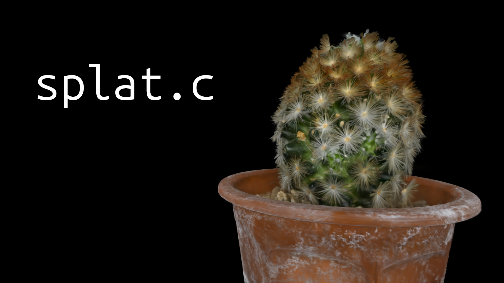

# splat.c - A 3DGS implementation in C99

Hobby implementation of [3D Gaussian Splatting](https://repo-sam.inria.fr/fungraph/3d-gaussian-splatting/) in pure C99.

**Features**

- Tiled Rendering
- Multi-Threading
- Interactive viewer
- Screenshots

**Planned**

- Improve wonky camera system
- Support additional formats like `.splat` and `.sog`
- Optimizations (memory, vectorization, etc.)
